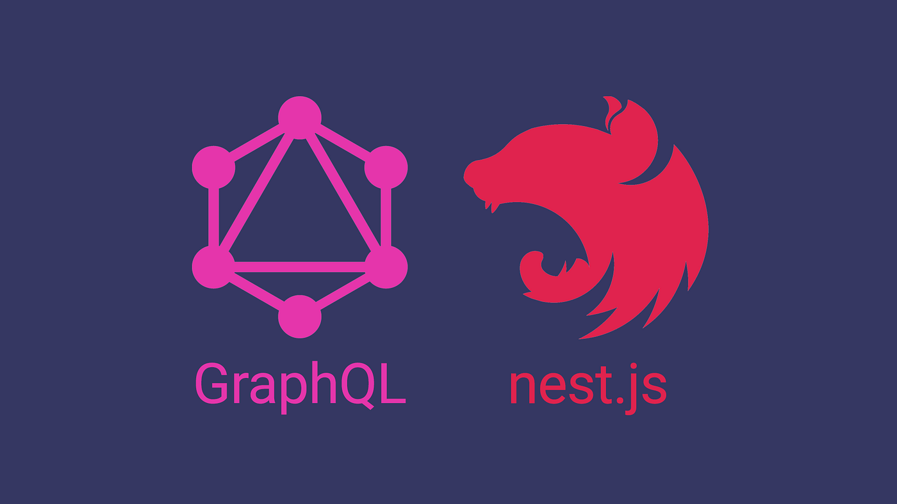

    

<h1 align="center">GraphQL and TypeORM with NestJs</h1>

  
  

    O projeto é uma base sólida de API Node.js com NestJS, projetada para simplificar  
    a criação de APIs pelos desenvolvedores, oferecendo uma estrutura organizada e configurações padrão.

 

  <a href="#-Bibliotecas-e-tecnologias">Bibliotecas e tecnologias</a>&nbsp;&nbsp;&nbsp;|&nbsp;&nbsp;&nbsp;
  <a href="#-Instalação-e-execução">Instalação e execução</a>

## 🩻 Estrutura de pastas

  A Clean Architecture é um modelo de design de software que enfatiza a separação de preocupações em camadas concêntricas, como Entidades, Casos de Uso e Interfaces de Fronteira.  
  Prioriza a independência de frameworks e detalhes de implementação, facilitando a manutenção e testabilidade do código.

    src                  → Application sources

      └ interfaces       → Interliga o externo do interno
        └ controllers    → Interface externa

      └ application      → Camada de serviços da aplicação
          └ use-cases    → Regras de negócios da aplicação
          └ utils        → Ferramentas úteis para o escopo da lógica de negócio

      └ infrastructure   → Frameworks, drivers, ferramentas como Database e etc.
        └ config         → Serviços de configuração da aplicação e servidor Web (servidor, rotas, plugins e etc.)
        └ database       → ORMs de banco de dados
          └ typeorm.ts   → Cliente e esquemas do typeorm
        └ security       → Implementações de ferramentas de segurança (ex: JwtAccessTokenManager)

## 📚 Bibliotecas e tecnologias

- [Clean architecture](https://www.google.com/search?q=o+que+%C3%A9+clean+architecture) | Um padrão de desenvolvimento de software
- [GraphQL](https://graphql.org/) | Uma linguagem de consulta para APIs
- [NodeJs](https://nodejs.org/) | Executa o JavaScript fora do navegador, no lado do servidor.
- [NestJs](https://nestjs.com/) | Um framework back-end que utiliza como padrão o TypeScript.
- [Typescript](https://www.typescriptlang.org/) | TypeScript é uma extensão do JavaScript que adiciona tipos estáticos opcionais para desenvolvimento mais seguro e produtivo.
- [Typeorm](https://typeorm.io/) | Uma biblioteca para facilitar o trabalho com bancos de dados relacionais usando TypeScript e JavaScript.
- [Axios](https://axios-http.com/ptbr/docs/intro) | Axios é uma biblioteca JavaScript para fazer requisições HTTP de forma fácil e eficiente.
- [Jsonwebtoken](https://www.npmjs.com/package/jsonwebtoken) | Uma estrutura de token segura usada para autenticação e troca de informações confiáveis.
- [Moment](https://www.npmjs.com/package/moment) | Uma biblioteca JavaScript para manipulação de datas e horários.
- [Eslint](https://eslint.org/) | Uma ferramenta de análise de código JavaScript que ajuda a identificar e corrigir problemas de qualidade e estilo no código-fonte.
- [Class validator](https://www.npmjs.com/package/class-validator) | Uma biblioteca para validar e verificar dados em classes e objetos em JavaScript/TypeScript.
- [Ip](https://www.npmjs.com/package/ip) | Uma ferramenta para trabalhar com endereços IP em JavaScript.

## 🧩 Instalação e execução

### Criar migration
    yarn typeorm migration:create src/infrastructure/typeorm/migrations/your-migrationName

### Executar a migration
    yarn migration
